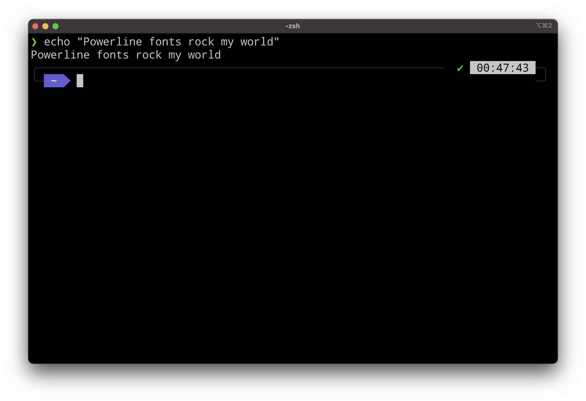

# tidy_powerline_installer

This is a super easy way to install Powerline fonts on MacOS.

I highly recommend that you DON'T run this command. Piping scirpts in the prompt is insane (saying this as a Cyber Security Expert). The practice needs to end.

If you're so inclined:

curl https://raw.githubusercontent.com/mvknowles/tidy_powerline_installer/master/install.sh | zsh

Please look at the script before running it!

Works on M1 MacOS!

